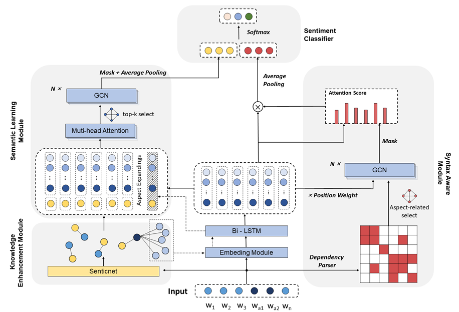

# KDGCN

**KDGCN** - **K**nowledge-Enhanced **D**ual-Channel **G**raph **C**onvolutional **N**etwork
* Code and preprocessed dataset for [Mathematic](https://www.mdpi.com/journal/mathematics) paper titled "[Knowledge-Enhanced Dual-Channel GCN for Aspect-Based Sentiment Analysis](https://www.mdpi.com/2227-7390/10/22/4273/html)"


## Requirements

* Python 3.7.0
* PyTorch 1.7.0
* SpaCy 3.2.4
* numpy 1.21.5

## Usage


* Download pretrained GloVe embeddings with this [link](http://nlp.stanford.edu/data/wordvecs/glove.840B.300d.zip) and extract `glove.840B.300d.txt` into `glove/glove/`.
* Download the files of SenticNet5 from [link](http://www.sentic.net/downloads/) ,such as 'affectivespace.csv' and 'senticnet5.py', and save them into 'knowledge/'.
* Download the datasets and pre-processed files (e.g. syntactic diagrams, emotion vectors, Aspect-expandings, etc.)
  with 'https://pan.baidu.com/s/1Wy5UxeBp0CfuJNeu1S_lhQ' (password:b37n) and save in the root directory. Or you can generate these files from [dependency_graph.py](/dependency_graph.py), [dependency_graph_bert.py](dependency_graph_bert.py), [./knowledge/knowledge_graph.py](/knowledge/knowledge_graph.py)
* Train with command, optional arguments could be found in [train.py](/train.py)
```bash
python train.py --model_name kdgcn --dataset rest14
```


## Model

An overview of our proposed model is given below



## Citation

If you use the code in your paper, please kindly star this repo and cite our paper

```bibtex
@article{zhang2022knowledge,
  title={Knowledge-Enhanced Dual-Channel GCN for Aspect-Based Sentiment Analysis},
  author={Zhang, Zhengxuan and Ma, Zhihao and Cai, Shaohua and Chen, Jiehai and Xue, Yun},
  journal={Mathematics},
  volume={10},
  number={22},
  pages={4273},
  year={2022},
  publisher={MDPI}
}
```

## Credits

* Code of this repo heavily relies on [ABSA-PyTorch](https://github.com/songyouwei/ABSA-PyTorch) and [ASGCN](https://github.com/GeneZC/ASGCN)